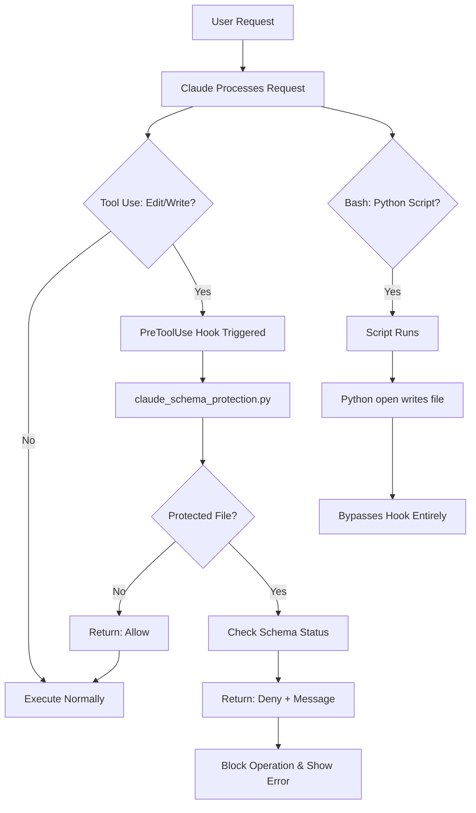

# Claude Code Schema Protection System

## Overview

This document explains the database schema protection system for Claude Code, which replaces the Git pre-commit hooks used in the previous Replit environment. The system uses Claude Code's **PreToolUse hook** to intercept and block manual edits to auto-generated database schema files.

## Migration from Replit

### Previous Implementation (Replit)
- **Method**: Git pre-commit hooks
- **Trigger**: Before git commit
- **Location**: `.git/hooks/pre-commit`
- **Enforcement**: Exit code blocking

### Current Implementation (Claude Code)
- **Method**: PreToolUse hook
- **Trigger**: Before Edit/Write tool execution
- **Location**: `.claude/settings.local.json` + `database_tools/claude_schema_protection.py`
- **Enforcement**: JSON permission decision

## Architecture

### Components

1. **Hook Script**: `database_tools/claude_schema_protection.py`
   - Python script that receives tool use attempts via stdin
   - Analyzes tool name and file path
   - Returns JSON decision to allow/deny operation
   - **Only intercepts Claude's Edit/Write tool calls**

2. **Hook Configuration**: `.claude/settings.local.json`
   - Registers the PreToolUse hook
   - Executes hook script before Edit/Write operations

3. **Integration**: `database_tools/enforce_automation.py`
   - Reused from Replit implementation
   - Provides schema change detection
   - Generates schema status information

### Critical Design Detail

**The hook only sees Claude's tool calls, not Python's file operations.**

- When Claude uses Edit/Write tools → Hook intercepts and can block
- When Python scripts use `open()` to write files → Hook never sees it
- This is by design: automation scripts bypass the hook entirely

### How It Works



## Protected Files

The following auto-generated files are protected from Claude's Edit/Write tools:

- `frontend_templates/database_schema.html`
- `database_tools/docs/database_schema.json`
- `database_tools/docs/database_schema.md`
- `database_tools/generated/models.py`
- `database_tools/generated/schemas.py`
- `database_tools/generated/crud.py`
- `database_tools/generated/routes.py`

## Automation Scripts

These Python scripts modify protected files using Python's file I/O (bypasses hooks):

- `database_tools/update_schema.py`
- `database_tools/schema_html_generator.py`
- `database_tools/database_schema_generator.py`
- `database_tools/code_generator.py`
- `database_tools/schema_automation.py`
- `database_tools/enforce_automation.py`

**Note**: These scripts are NOT whitelisted in the hook because they don't need to be. They use Python's `open()` function to write files, which completely bypasses Claude Code's tool system and hooks.

## Key Features

### 1. **Surgical Precision**
- Only intercepts Edit/Write tools (Claude's direct edits)
- Allows Read operations on protected files
- Non-protected files are unaffected
- Automation scripts bypass hooks entirely (use Python I/O)

### 2. **Schema Status Integration**
- Queries current schema status via `enforce_automation.py`
- Includes schema change information in error messages
- Provides actionable guidance based on current state

### 3. **Path Normalization**
- Handles absolute paths (`/workspace/...`)
- Handles workspace protocol paths (`//workspace/...`)
- Handles worktree paths (`.trees/claude-config/...`)

### 4. **Fail-Safe Design**
- On hook errors, allows operation (won't break workflow)
- Logs error reason for debugging
- Graceful degradation ensures system availability

### 5. **Simple and Maintainable**
- No complex context detection logic
- No whitelisting needed (automation scripts bypass hooks)
- Easy to understand and debug

## Usage Examples

### Scenario 1: Manual Edit Blocked

**User Action:**
```
User: "Edit database_tools/generated/models.py and add a User model"
```

**System Response:**
```
🛡️  DATABASE SCHEMA PROTECTION

❌ BLOCKED: Manual edit to auto-generated file
📁 File: database_tools/generated/models.py
🔧 Tool: Edit

⚠️  This file is auto-generated from the PostgreSQL schema.
   Manual edits will be overwritten and cause inconsistencies.

✅ REQUIRED WORKFLOW:
   1. Make changes to PostgreSQL database schema
   2. Run: python database_tools/update_schema.py
   3. Review and commit generated files

📊 SCHEMA STATUS: Up to date
   If you need to make changes, modify the PostgreSQL schema first.

📚 See: docs/development/standards/AUTOMATED_TOOLING_GUIDE.md
🔗 Or run: python database_tools/enforce_automation.py --check
```

### Scenario 2: Automation Script Runs

**User Action:**
```
User: "Run python database_tools/update_schema.py"
```

**System Response:**
```
[Bash tool executes: python database_tools/update_schema.py]
[Python script writes to generated/models.py using open()]
[Hook is NOT triggered - Python file I/O bypasses Claude tools]
[Files updated successfully]
```

**Why This Works:**
The Python script uses `open('generated/models.py', 'w')` which is a direct file operation, not a Claude Code tool call. The hook only intercepts Claude's Edit/Write tools.

### Scenario 3: Read Operation Allowed

**User Action:**
```
User: "Show me the contents of database_tools/generated/models.py"
```

**System Response:**
```
[Read tool executes normally - no interception]
[File contents displayed]
```

## Configuration

### Hook Configuration (`.claude/settings.local.json`)

```json
{
  "permissions": {
    "allow": [
      "Read(//workspace/.claude/**)",
      "Bash(chmod:*)",
      "Read(//workspace/**)"
    ],
    "deny": [],
    "ask": []
  },
  "hooks": {
    "PreToolUse": [
      {
        "hooks": [
          {
            "type": "command",
            "command": "python database_tools/claude_schema_protection.py"
          }
        ]
      }
    ]
  }
}
```

### Hook Script Permissions

The hook script must be executable:
```bash
chmod +x database_tools/claude_schema_protection.py
```

## Testing

### Manual Testing

Test with protected file edit (should block):
```bash
echo '{
  "session_id": "test-123",
  "transcript_path": "/tmp/test.jsonl",
  "cwd": "/workspace/.trees/claude-config",
  "hook_event_name": "PreToolUse",
  "tool_name": "Edit",
  "tool_input": {
    "file_path": "/workspace/.trees/claude-config/database_tools/generated/models.py",
    "old_string": "test",
    "new_string": "modified"
  }
}' | python database_tools/claude_schema_protection.py
```

Expected output: JSON with `"permissionDecision": "deny"`

Test with Read operation (should allow):
```bash
echo '{
  "session_id": "test-123",
  "transcript_path": "/tmp/test.jsonl",
  "cwd": "/workspace/.trees/claude-config",
  "hook_event_name": "PreToolUse",
  "tool_name": "Read",
  "tool_input": {
    "file_path": "/workspace/.trees/claude-config/database_tools/generated/models.py"
  }
}' | python database_tools/claude_schema_protection.py
```

Expected output: `{}`

### Automated Testing

A test suite is available at:
`archived_files/tests_legacy_2025_07_28/legacy_tests_directory/test_enforcement.py`

This can be adapted for Claude Code hook testing.

## Troubleshooting

### Hook Not Triggering

**Symptoms**: Protected files can be edited manually

**Diagnosis**:
1. Check `.claude/settings.local.json` has hooks configured
2. Verify hook script is executable: `ls -l database_tools/claude_schema_protection.py`
3. Test hook manually (see Testing section)

**Solution**:
```bash
chmod +x database_tools/claude_schema_protection.py
# Restart Claude Code session
```

### Hook Blocking Legitimate Operations

**Symptoms**: Automation scripts can't update protected files

**Diagnosis**:
1. Check transcript path is accessible
2. Verify automation script is in whitelist
3. Review hook logs for context detection

**Solution**:
Add script to `AUTOMATION_SCRIPTS` list in `claude_schema_protection.py`:
```python
AUTOMATION_SCRIPTS = [
    'database_tools/update_schema.py',
    'database_tools/your_new_script.py',  # Add here
    ...
]
```

### Hook Errors Breaking Workflow

**Symptoms**: Hook throws exception and breaks operations

**Diagnosis**:
1. Run hook manually with test input
2. Check Python dependencies
3. Review error in hook output

**Solution**:
The hook is designed to fail-safe. On errors, it allows operations but logs the error. Check the error message for root cause.

## Integration with Existing Workflow

### Required Workflow (Unchanged)

1. Make schema changes to PostgreSQL database
2. Run: `python database_tools/update_schema.py`
3. Commit generated files to version control

### Enforcement Points

| Environment | Enforcement Point | Method |
|-------------|------------------|--------|
| Replit | Git commit | Pre-commit hook |
| Claude Code | Tool execution | PreToolUse hook |

### Tools Integration

The following existing tools work seamlessly:

- ✅ `database_tools/enforce_automation.py` - Schema change detection
- ✅ `database_tools/update_schema.py` - Schema update automation
- ✅ `database_tools/schema_automation.py` - Automated workflow
- ✅ `database_tools/AUTOMATION_REMINDER.md` - Documentation

## Maintenance

### Adding Protected Files

Edit `claude_schema_protection.py`:
```python
PROTECTED_FILES = [
    'frontend_templates/database_schema.html',
    'your/new/protected/file.py',  # Add here
    ...
]
```

### Adding Automation Scripts

Edit `claude_schema_protection.py`:
```python
AUTOMATION_SCRIPTS = [
    'database_tools/update_schema.py',
    'database_tools/your_automation_script.py',  # Add here
    ...
]
```

### Updating Hook Logic

Edit `database_tools/claude_schema_protection.py` and modify:
- `should_intercept()` - Change interception logic
- `is_automation_context()` - Improve context detection
- `generate_response()` - Customize error messages

## Best Practices

1. **Never manually edit protected files** - Use automation workflow
2. **Test hook changes thoroughly** - Use manual testing commands
3. **Keep whitelist updated** - Add new automation scripts promptly
4. **Monitor hook performance** - Check for false positives/negatives
5. **Document changes** - Update this document when modifying system

## References

- [Automated Tooling Guide](./standards/AUTOMATED_TOOLING_GUIDE.md)
- [Database Automation Enforcement (Archived)](../archived/archived_2025_07_28/DATABASE_AUTOMATION_ENFORCEMENT.md)
- [Claude Code Hooks Documentation](https://docs.claude.com/en/docs/claude-code/hooks)

---

**Document Version:** 1.0
**Created:** 2025-10-06
**Environment:** Claude Code
**Replaces:** Git pre-commit hooks (Replit environment)
