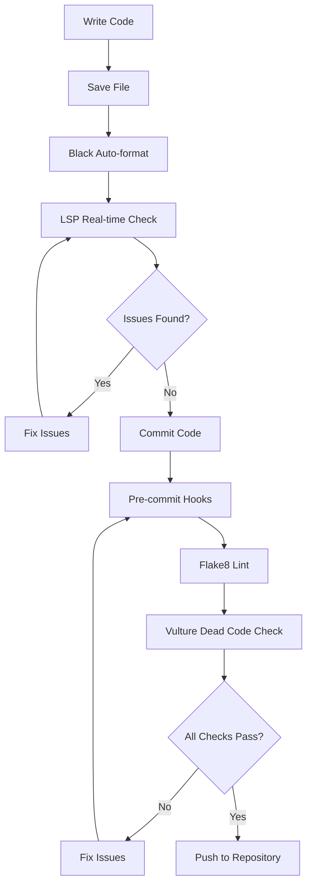

# Automated Tooling Configuration Guide

## Purpose
This guide documents the automated development tools configured for the Automated Job Application System, including their setup, configuration, and maintenance procedures. These tools ensure consistent code quality, formatting, and security standards across the development lifecycle.

## Tool Overview

### Primary Tools
1. **Black** - Uncompromising Python code formatter
2. **Flake8** - Python linting and style guide enforcement
3. **Vulture** - Dead code detection and cleanup
4. **LSP (Language Server Protocol)** - Real-time code analysis

### Tool Selection Rationale
- **Consistency**: Eliminates style debates through automation
- **Quality**: Catches potential issues before they reach production
- **Efficiency**: Reduces code review time on formatting concerns
- **Maintainability**: Keeps codebase clean and organized

## Black Configuration

### Configuration File: `.black.toml`
```toml
[tool.black]
line-length = 120
target-version = ['py311']
include = '\.pyi?$'
exclude = '''
/(
    \.git
  | \.cache
  | archived_files
  | storage
  | __pycache__
)/
'''
```

### Configuration Explanation
- **line-length = 120**: Chosen for modern wide displays while maintaining readability
- **target-version = ['py311']**: Matches production Python version
- **include**: Processes all Python files (.py and .pyi)
- **exclude**: Skips generated files, caches, and archived code

### Usage Commands
```bash
# Format all Python files
black .

# Check formatting without making changes
black --check .

# Format specific file
black modules/database/database_manager.py

# See what changes would be made
black --diff .
```

### Integration Points
- **Pre-commit**: Automatically formats staged files
- **CI/CD**: Verifies formatting in build pipeline
- **IDE**: Real-time formatting on save
- **Code Review**: Blocks commits with formatting issues

## Flake8 Configuration

### Configuration File: `.flake8`
```ini
[flake8]
max-line-length = 120
exclude = .git,__pycache__,archived_files,.cache,storage
ignore = E203,W503
```

### Configuration Explanation
- **max-line-length = 120**: Matches Black's line length setting
- **exclude**: Skips auto-generated and temporary directories
- **ignore E203**: Whitespace before ':' (conflicts with Black)
- **ignore W503**: Line break before binary operator (conflicts with Black)

### Error Categories
```
E1xx: Indentation errors
E2xx: Whitespace errors
E3xx: Blank line errors
E4xx: Import errors
E5xx: Line length errors
E7xx: Statement errors
E9xx: Runtime errors
W1xx: Indentation warnings
W2xx: Whitespace warnings
W3xx: Blank line warnings
W5xx: Line length warnings
W6xx: Deprecation warnings
```

### Usage Commands
```bash
# Lint all Python files
flake8

# Lint specific directory
flake8 modules/

# Show statistics
flake8 --statistics

# Generate detailed report
flake8 --format=html --htmldir=flake8_report
```

### Common Error Resolutions
```python
# E302: Expected 2 blank lines, found 1
# Solution: Add proper spacing between top-level definitions

class JobManager:  # ← Add blank line before this
    pass


def process_job():  # ← Add blank line before this
    pass

# F401: Module imported but unused
# Solution: Remove unused import or add # noqa comment
import os  # noqa: F401  # Used in dynamic execution

# E501: Line too long
# Solution: Break into multiple lines
long_function_call(
    very_long_parameter_name,
    another_long_parameter,
    third_parameter
)
```

## Vulture Configuration

### Configuration File: `.vulture.toml`
```toml
[tool.vulture]
min_confidence = 80
exclude = ["archived_files", ".cache", "__pycache__", "storage"]
```

### Configuration Explanation
- **min_confidence = 80**: Balance between false positives and detection accuracy
- **exclude**: Skips directories that may contain intentionally unused code

### Usage Commands
```bash
# Find dead code
vulture

# Include lower confidence matches
vulture --min-confidence 60

# Generate report
vulture --make-whitelist > vulture_whitelist.py

# Exclude specific warnings
vulture --exclude archived_files,tests
```

### Handling False Positives
```python
# Create whitelist file for legitimate unused code
# vulture_whitelist.py

# Used in dynamic imports
module_registry = {}

# Used in template rendering
template_variables = {
    'user_name': '',
    'job_title': '',
}

# Used in external API callbacks
def webhook_handler(request):
    pass
```

### Common Dead Code Patterns
- Unused imports
- Unreachable code after return statements
- Unused function parameters
- Commented-out code blocks
- Legacy compatibility functions

## LSP Diagnostics

### Setup and Configuration
LSP provides real-time code analysis through the language server protocol, offering:
- Syntax error detection
- Type checking
- Import resolution
- Function signature help
- Auto-completion

### Diagnostic Categories
```
Error: Critical issues that prevent code execution
Warning: Potential problems that should be addressed
Information: Suggestions for improvement
Hint: Minor style or efficiency recommendations
```

### Common LSP Issues and Solutions
```python
# Type annotation mismatches
def process_data(data: List[str]) -> Dict[str, int]:
    # LSP Error: Return type doesn't match annotation
    return data  # Should return Dict[str, int]

# Solution: Fix return type or annotation
def process_data(data: List[str]) -> Dict[str, int]:
    return {item: len(item) for item in data}

# Missing imports
from datetime import datetime  # ← Add this import

def get_timestamp() -> datetime:
    return datetime.now()  # LSP Error: 'datetime' is not defined

# Unused variables
def process_application(app_data: dict) -> bool:
    user_id = app_data.get('user_id')  # LSP Warning: unused variable
    job_title = app_data.get('job_title')
    return submit_application(job_title)

# Solution: Use the variable or prefix with underscore
def process_application(app_data: dict) -> bool:
    _user_id = app_data.get('user_id')  # Prefix with _ for intentionally unused
    job_title = app_data.get('job_title')
    return submit_application(job_title)
```

## Tool Integration Workflow

### Development Workflow


### Pre-commit Hook Configuration
```yaml
# .pre-commit-config.yaml
repos:
  - repo: https://github.com/psf/black
    rev: 23.3.0
    hooks:
      - id: black
        language_version: python3.11

  - repo: https://github.com/pycqa/flake8
    rev: 6.0.0
    hooks:
      - id: flake8

  - repo: local
    hooks:
      - id: vulture
        name: vulture
        entry: vulture
        language: system
        types: [python]
```

### CI/CD Pipeline Integration
```yaml
# Example GitHub Actions workflow
name: Code Quality
on: [push, pull_request]

jobs:
  quality:
    runs-on: ubuntu-latest
    steps:
    - uses: actions/checkout@v3
    - name: Set up Python
      uses: actions/setup-python@v4
      with:
        python-version: '3.11'
    
    - name: Install dependencies
      run: |
        pip install black flake8 vulture
    
    - name: Check formatting with Black
      run: black --check .
    
    - name: Lint with Flake8
      run: flake8
    
    - name: Check for dead code with Vulture
      run: vulture --min-confidence 80
```

## Maintenance Procedures

### Regular Maintenance Tasks

#### Weekly
- [ ] Review Vulture reports for dead code cleanup
- [ ] Check for new Flake8 rule violations
- [ ] Verify Black formatting consistency

#### Monthly
- [ ] Update tool versions to latest stable releases
- [ ] Review and update tool configurations
- [ ] Analyze dead code patterns and whitelist updates

#### Quarterly
- [ ] Comprehensive codebase analysis
- [ ] Tool configuration optimization
- [ ] Integration workflow improvements

### Tool Updates

#### Updating Black
```bash
# Check current version
black --version

# Update to latest version
pip install --upgrade black

# Test new version on sample files
black --check modules/database/

# Update configuration if needed
# Edit .black.toml for new features
```

#### Updating Flake8
```bash
# Check current version and plugins
flake8 --version

# Update flake8 and common plugins
pip install --upgrade flake8 flake8-import-order flake8-docstrings

# Test configuration
flake8 --config=.flake8 modules/

# Review new error codes and update ignore list if needed
```

#### Updating Vulture
```bash
# Update vulture
pip install --upgrade vulture

# Test with current configuration
vulture --min-confidence 80

# Update whitelist for new false positives
vulture --make-whitelist >> vulture_whitelist.py
```

### Troubleshooting Common Issues

#### Black Formatting Conflicts
```bash
# If Black conflicts with existing formatting:
# 1. Check for syntax errors first
python -m py_compile problematic_file.py

# 2. Apply Black formatting manually
black problematic_file.py

# 3. Review changes and test
git diff problematic_file.py
```

#### Flake8 Performance Issues
```bash
# For large codebases, optimize Flake8 performance:
# 1. Use parallel processing
flake8 --jobs=auto

# 2. Exclude unnecessary directories
flake8 --exclude=archived_files,storage,venv

# 3. Use select/ignore strategically
flake8 --select=E,W,F --ignore=E203,W503
```

#### Vulture False Positives
```python
# Create project-specific whitelist
# whitelist.py

# Framework-required methods (may appear unused)
def __str__(self):
    pass

def save(self):
    pass

# Template variables (used in Jinja2 templates)
template_context = {
    'user_name': '',
    'company_name': '',
    'job_title': '',
}

# Callback functions (called by external systems)
def webhook_callback(data):
    pass
```

## Best Practices

### Configuration Management
1. **Version Control**: Always commit tool configuration files
2. **Documentation**: Document any custom rules or exceptions
3. **Team Alignment**: Ensure all developers use same tool versions
4. **Regular Updates**: Keep tools updated for security and features

### Error Resolution Priority
1. **Syntax Errors**: Fix immediately (blocks execution)
2. **Security Issues**: High priority (Flake8 security plugins)
3. **Type Errors**: Medium priority (LSP diagnostics)
4. **Style Issues**: Low priority (but enforce consistently)
5. **Dead Code**: Cleanup priority (technical debt)

### Tool Customization Guidelines
- **Minimal Configuration**: Use tool defaults when possible
- **Project-Specific Rules**: Only add rules that serve project needs
- **Team Consensus**: All configuration changes require team agreement
- **Documentation**: Document all custom configurations and reasons

---

**Document Maintained By:** Development Team  
**Last Updated:** July 30, 2025  
**Tool Versions:** Black 23.3.0, Flake8 6.0.0, Vulture 2.7  
**Review Frequency:** Monthly  
**Version:** 1.0  