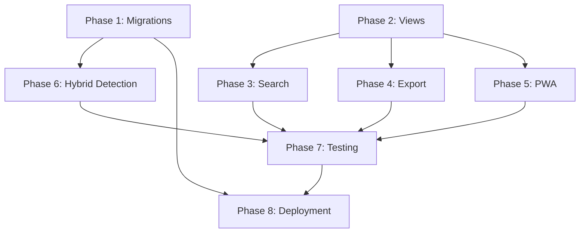

# Dashboard Implementation - Quick Reference

**Total Time:** 35-40 hours | **Priority Phases:** 1, 2, 7, 8

---

## 📊 Implementation Order (Recommended)

### Week 1: Core Foundation (10-12h)
```
Day 1  → Phase 1: Fix Migrations (3-4h) ⚠️ CRITICAL
Day 2  → Phase 2.1: Applications View (2-3h)
Day 3  → Phase 2.2: Analytics View (3-4h)
```

### Week 2: Enhancement (12-15h)
```
Day 4-5  → Phase 3: Search & Filters (4-5h)
Day 5    → Phase 4: Export (2-3h)
Day 5-6  → Phase 6: Hybrid Detection (5-7h)
```

### Week 3: Production Ready (13-16h)
```
Day 7-8  → Phase 2.3: Schema Viz (2h) + Phase 5: PWA (3-4h)
Day 8    → Phase 6: Detection Integration (3-4h)
Day 9    → Phase 7: Testing (4-6h)
Day 9-10 → Phase 8: Deployment (4-6h)
```

---

## 🎯 Phase Summary

| Phase | Name | Time | Complexity | Priority | Can Defer? |
|-------|------|------|------------|----------|------------|
| 1 | Fix Blocked Migrations | 3-4h | Medium | CRITICAL | ❌ No |
| 2 | Complete Dashboard Views | 7-9h | Medium-High | HIGH | ⚠️ Partial |
| 3 | Search & Filters | 4-5h | Medium | MEDIUM | ✅ Yes |
| 4 | Export Functionality | 2-3h | Low-Medium | MEDIUM | ✅ Yes |
| 5 | PWA Features | 3-4h | Medium | LOW | ✅ Yes |
| 6 | Hybrid Detection | 8-10h | High | MEDIUM | ✅ Yes |
| 7 | Testing & Quality | 10-12h | Medium-High | HIGH | ⚠️ Partial |
| 8 | Production Deployment | 6-8h | Medium | CRITICAL | ❌ No |

**Must Complete:** Phases 1, 2, 7 (minimal), 8
**Optional:** Phases 3, 4, 5, 6
**Already Deferred:** Comprehensive testing (see .deferral-notes.md)

---

## 🔗 Dependencies



**Critical Path:** P1 → P6 → P7 → P8 (28h minimum)
**Parallel Path:** P2 → P3 → P4 → P5 → P7 (18-24h)

---

## ⚡ Quick Start: Minimum Viable Dashboard

**Goal:** Get working dashboard in production ASAP

**Phases to Complete:** 1, 2.1, 2.2, 7 (minimal), 8
**Total Time:** ~20-25 hours

```
Week 1 (Day 1-2):
✅ Phase 1: Fix migrations (4h)
✅ Phase 2.1: Applications view (2h)
✅ Phase 2.2: Analytics view (3h)

Week 2 (Day 3-4):
✅ Phase 7: Critical tests only (4h)
  - API endpoint tests
  - Migration tests
  - Basic frontend tests
✅ Phase 8: Deploy to production (6h)

Total: ~19 hours
```

**Defer:** Search, Export, PWA, Hybrid Detection, Schema Viz

---

## 🚨 Critical Issues to Fix

### Issue 1: Database Schema Mismatch (BLOCKING)

**Columns that DON'T exist:**
- ❌ `jobs.priority_score` → Use `NULL` placeholder
- ❌ `jobs.salary_currency` → Use `compensation_currency`
- ❌ `jobs.location` → Synthesize from `office_city, office_province, office_country`
- ❌ `jobs.experience_level` → Use `seniority_level`

**Files to Fix:**
1. `database_migrations/001_dashboard_optimization_indexes.sql`
2. `database_migrations/002_dashboard_materialized_views.sql`
3. `database_migrations/003_dashboard_aggregation_tables.sql`

**Note:** Migration 002 (lines 40-47) already has partial fixes!

### Issue 2: Missing API Endpoints

**Need to Create:**
- `GET /api/v2/dashboard/applications` (for Applications view)
- `GET /api/v2/dashboard/jobs/filter` (for Search)
- `POST /api/v2/dashboard/search` (for Global Search)
- `GET /api/v2/dashboard/export/{type}` (for Export)
- `GET /api/v2/dashboard/schema` (for Schema Viz)

### Issue 3: Frontend Views Incomplete

**Files with Mock Data:**
- `frontend_templates/dashboard_applications.html` (line 98)
- `frontend_templates/dashboard_analytics.html` (needs Chart.js setup)

**Files to Create:**
- `frontend_templates/dashboard_schema.html` (new)

---

## 📁 File Checklist

### Must Modify
- [ ] `database_migrations/001_*.sql` - Fix column names
- [ ] `database_migrations/002_*.sql` - Fix column names
- [ ] `database_migrations/003_*.sql` - Fix column names
- [ ] `modules/dashboard_api_v2.py` - Add new endpoints
- [ ] `frontend_templates/dashboard_applications.html` - Connect to real API
- [ ] `frontend_templates/dashboard_analytics.html` - Setup Chart.js

### Must Create
- [ ] `frontend_templates/dashboard_schema.html` - New view
- [ ] `static/manifest.json` - PWA manifest
- [ ] `static/sw.js` - Service worker
- [ ] `modules/ai_job_description_analysis/field_detector.py` - Regex detection
- [ ] `modules/ai_job_description_analysis/ai_field_extractor.py` - AI detection
- [ ] `modules/ai_job_description_analysis/hybrid_detector.py` - Pipeline
- [ ] `tests/test_dashboard_api_v2.py` - API tests
- [ ] `tests/test_dashboard_migrations.py` - Migration tests
- [ ] `tests/test_hybrid_detection.py` - Detection tests

### Already Complete ✅
- ✅ `static/css/dashboard_v2.css` - Styling
- ✅ `frontend_templates/dashboard_v2.html` - Main dashboard
- ✅ `frontend_templates/dashboard_jobs.html` - Jobs view
- ✅ `modules/dashboard_api_v2.py` - Base API (needs extensions)
- ✅ `modules/realtime/sse_dashboard.py` - Real-time SSE
- ✅ `modules/cache/simple_cache.py` - Caching
- ✅ `app_modular.py` - Blueprints registered

---

## 🎯 Success Metrics

### Phase 1 Success
- ✅ Migrations run without errors
- ✅ Dashboard API <50ms (down from 250ms)
- ✅ Indexes verified in `pg_indexes`

### Phase 2 Success
- ✅ Applications view shows real data
- ✅ Analytics has 4 working charts
- ✅ All views responsive

### Phase 7 Success
- ✅ Test coverage >80% for dashboard
- ✅ All tests passing
- ✅ No security vulnerabilities

### Phase 8 Success
- ✅ Production accessible via HTTPS
- ✅ All features working
- ✅ Monitoring active

---

## 🔧 Commands Reference

### Development
```bash
# Start development server
python app_modular.py

# Start standalone demo (no DB)
python scripts/dashboard_standalone.py

# Run migrations
python database_migrations/run_migrations.py

# Verify migrations
psql -h localhost -U postgres -d local_Merlin_3 -c "\d+ jobs"
```

### Testing
```bash
# Run all tests
pytest tests/ -v

# Run dashboard tests only
pytest tests/test_dashboard* -v

# Check coverage
pytest tests/ --cov=modules/dashboard_api_v2 --cov-report=term

# Run frontend tests (after implementing)
pytest tests/integration/test_dashboard_frontend.py -v
```

### Deployment
```bash
# Deploy to production
./deploy.sh

# Rollback if needed
./rollback.sh

# Check service status
systemctl status dashboard.service

# View logs
journalctl -u dashboard.service -f
```

---

## 💡 Tips & Tricks

### Faster Migration Testing
```bash
# Create backup before testing
pg_dump -h localhost -U postgres local_Merlin_3 > backup.sql

# Test migration
python database_migrations/run_migrations.py

# If failed, restore
psql -h localhost -U postgres -d local_Merlin_3 < backup.sql
```

### Debugging SSE Connection
```bash
# Test SSE endpoint manually
curl -N http://localhost:5000/api/stream/dashboard

# Should see:
# event: connected
# data: {"message": "Connected to dashboard stream"}
```

### Performance Benchmarking
```bash
# Before migrations
time curl http://localhost:5000/api/v2/dashboard/overview

# After migrations (should be <50ms)
time curl http://localhost:5000/api/v2/dashboard/overview
```

### Chart.js Quick Setup
```javascript
// In dashboard_analytics.html
const ctx = document.getElementById('applicationsChart');
new Chart(ctx, {
  type: 'line',
  data: {
    labels: [], // dates
    datasets: [{
      label: 'Applications',
      data: [], // counts
      borderColor: '#00d9ff',
      tension: 0.4
    }]
  }
});
```

---

## ⚠️ Common Pitfalls

### 1. Migration Column Names
**Pitfall:** Using `salary_currency` instead of `compensation_currency`
**Solution:** Always verify with `\d+ jobs` before writing migrations

### 2. SSE Buffering in nginx
**Pitfall:** nginx buffers SSE responses by default
**Solution:** Add `proxy_buffering off;` for `/api/stream/*` location

### 3. Chart.js Not Rendering
**Pitfall:** Canvas element hidden before Chart.js initializes
**Solution:** Initialize charts in `x-init` after DOM ready

### 4. PWA Not Installing
**Pitfall:** Missing HTTPS or invalid manifest
**Solution:** Use `localhost` for testing, validate manifest at `web.dev/manifest-validator`

### 5. Export Timeout
**Pitfall:** Large exports (>5000 rows) timeout
**Solution:** Use streaming responses with chunked encoding

---

## 📞 Decision Points

### Should I implement search before export?
**Answer:** Either order works. Search is more user-facing.

### Can I skip PWA features?
**Answer:** Yes, it's LOW priority and independent.

### Should I use Gemini for all field detection?
**Answer:** No, use regex first (free), AI only for complex cases.

### Can I deploy without all tests?
**Answer:** Minimum tests required: API endpoints, migrations, critical paths.

### Should I optimize all queries now?
**Answer:** No, migrations handle most optimization. Optimize outliers later.

---

## 🎓 Learning Resources

### Alpine.js
- Docs: https://alpinejs.dev/
- Tutorial: "Alpine.js in 5 minutes"

### Chart.js
- Docs: https://www.chartjs.org/
- Examples: https://www.chartjs.org/docs/latest/samples/

### PWA
- Guide: https://web.dev/progressive-web-apps/
- Manifest: https://web.dev/add-manifest/
- Service Workers: https://web.dev/service-workers-cache-storage/

### PostgreSQL Performance
- Indexes: https://www.postgresql.org/docs/current/indexes.html
- Materialized Views: https://www.postgresql.org/docs/current/sql-creatematerializedview.html

---

**For detailed implementation, see:** [DASHBOARD_IMPLEMENTATION_PLAN.md](DASHBOARD_IMPLEMENTATION_PLAN.md)

**For handoff context, see:** [docs/DASHBOARD_V2_HANDOFF.md](docs/DASHBOARD_V2_HANDOFF.md)

**For quick testing, see:** [docs/dashboard-v2-features.md](docs/dashboard-v2-features.md)

